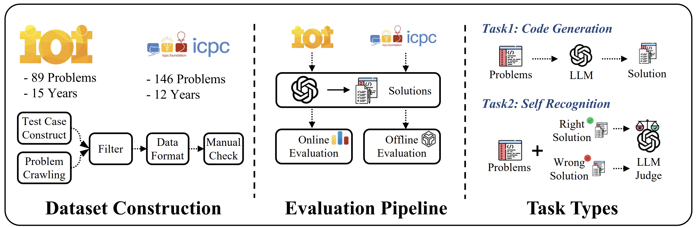

<p align="center">
  <h2 align="center">MMDocRAG: Benchmarking Retrieval-Augmented Multimomal Generation for Document Question Answering</h2>
    <p align="center">
    <a href="https://archersama.github.io/"><strong>Xiangyang Li</strong></a>
    ·
    <a href="https://xiaopengli1.github.io/"><strong>Xiaopeng Li</strong></a>
    ·
    <strong>Kuicai Dong</strong>
    ·
    <strong>Zhangquan Hu</strong>  
    ·
    <strong>Rongju Ruan</strong>
    ·
    <strong>Xinyi Dai</strong>
    ·
    <a href="https://scholar.google.com/citations?user=x-UYeJ4AAAAJ&hl=en"><strong>Yasheng Wang</strong></a>
    ·
    <a href="https://scholar.google.com/citations?user=fUtHww0AAAAJ&hl=en"><strong>Ruiming Tang</strong></a>
<p align="center">
    📖<a href="https://arxiv.org/abs/xxx">Paper</a> |
    🏠<a href="https://Humanity-s-Last-Code-Exam.github.io/HLCE/">Homepage</a> |
    🤗<a href="https://huggingface.co/datasets/xxx">Huggingface</a> |
	👉<a href="https://github.com/Humanity-s-Last-Code-Exam/HLCE">Github</a>
</p>
<p align="left">
  <p>
Code generation is a core capability of large language models (LLMs), yet mainstream benchmarks (e.g., APPs and LiveCodeBench) contain questions with medium-level difficulty and pose no challenge to advanced LLMs. To better reflect advanced reasoning and code generation ability, we introduce Humanity's Last Code Exam (HLCE), comprising 235 of the most challenging problems from the International Collegiate Programming Contest (ICPC World Finals) and the International Olympiad in Informatics (IOI) spanning 2010-2024.
  </p>
  <a href="">
    
  </a>
<br>


## 🛠️Dataset Usage

- 去哪里download dataset

- 如何处理数据blabla


## 🔮Dataset Evaluation

- 对于IOI，请依照这个指令来得到最终的评测结果

- 对于ICPC-World-Finals，请依照这个指令来得到最终的结果


## 💾Citation
```
@misc{,
      
}
```


## 📄 License

  **Usage and License Notices**: The data and code are intended and licensed for research use only.
License: Attribution-NonCommercial 4.0 International It should abide by the policy of OpenAI: https://openai.com/policies/terms-of-use
