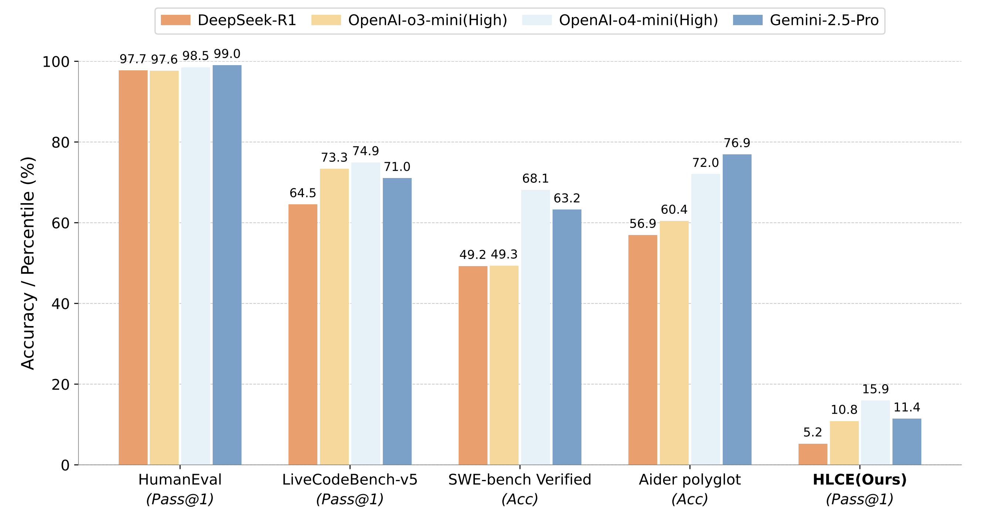

<p align="center">
  <h2 align="center">Humanity's Last Code Exam: Can Advanced LLMs Conquer Human's Hardest Code Competition?</h2>
    <p align="center">
    <a href="https://archersama.github.io/"><strong>Xiangyang Li</strong></a>
    ·
    <a href="https://xiaopengli1.github.io/"><strong>Xiaopeng Li</strong></a>
    ·
    <strong>Kuicai Dong</strong>
    ·
    <strong>Quanhu Zhang</strong>  
    ·
    <strong>Rongju Ruan</strong>
    ·
    <strong>Xinyi Dai</strong>
    ·
    <a href="https://scholar.google.com/citations?user=x-UYeJ4AAAAJ&hl=en"><strong>Yasheng Wang</strong></a>
    ·
    <a href="https://scholar.google.com/citations?user=fUtHww0AAAAJ&hl=en"><strong>Ruiming Tang</strong></a>
<p align="center">
    📖<a href="https://arxiv.org/abs/xxx">Paper</a> |
    🏠<a href="https://Humanity-s-Last-Code-Exam.github.io/HLCE/">Homepage</a> |
    🤗<a href="https://huggingface.co/datasets/xxx">Huggingface</a> |
	👉<a href="https://github.com/Humanity-s-Last-Code-Exam/HLCE">Github</a>
</p>
<p align="left">
  <p>
Code generation is a core capability of large language models (LLMs), yet mainstream benchmarks (e.g., APPs and LiveCodeBench) contain questions with medium-level difficulty and pose no challenge to advanced LLMs. To better reflect advanced reasoning and code generation ability, we introduce Humanity's Last Code Exam (HLCE), comprising 235 of the most challenging problems from the <strong>International Collegiate Programming Contest (ICPC World Finals)</strong> and the International <strong>Olympiad in Informatics (IOI)</strong> spanning 2010-2024.

  </p>
  <a href="">
    
  </a>
<br>


## Why Do We Need HLCE?

With the increasing capabilities of LLMs, many benchmarks have become too easy!




## 🛠️Dataset Usage

- You can peruse and download our dataset via this link: https://huggingface.co/HumanLastCodeExam


## 🔮Dataset Evaluation

- For IOI, kindly follow these [instructions](https://github.com/Humanity-s-Last-Code-Exam/HLCE/tree/main/HLCE/IOI_scripts) to obtain the definitive evaluation results.

- For ICPC-World-Finals,kindly follow these [instructions](https://github.com/Humanity-s-Last-Code-Exam/HLCE/tree/main/HLCE/ICPC-World-Finals_script) to obtain the definitive evaluation results.


## 📊 Leaderboard
- If you wish to submit your model to the leaderboard, please follow the [instructions](https://github.com/Humanity-s-Last-Code-Exam/results).

## 💾Citation
```
@misc{,
      
}
```


## 📄 License

  **Usage and License Notices**: The data and code are intended and licensed for research use only.
License: Attribution-NonCommercial 4.0 International It should abide by the policy of OpenAI: https://openai.com/policies/terms-of-use
